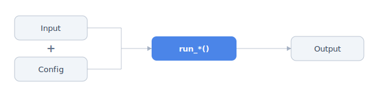

# Finding Tools

This note covers how to discover, inspect, and call every registered tool through `ToolRegistry` and the `proto-tools` CLI, namely discovery, prose documentation, Pydantic schemas, example inputs, citations, links, license and access metadata, and run functions. The same API supports in-process Python callers, scripts, notebooks, MCP/wire consumers, and the `proto-tools` CLI.

## Python Entry Point

```python
from proto_tools.tools.tool_registry import ToolRegistry
```

Returned values are Pydantic v2 `BaseModel` instances or plain JSON-serializable types. Outputs should round-trip through `.model_dump()` or `.model_dump_json()`.

## CLI

```bash
proto-tools list --category masked_models
proto-tools catalog --json
proto-tools docs esm2-embedding
proto-tools docs esm2-embedding --json
proto-tools schema esm2-embedding --input
proto-tools example-input esm2-embedding
proto-tools access esm3-embedding
```

`python -m proto_tools` is equivalent when the `proto-tools` executable is shadowed. Use `--json` on commands that return structured payloads when a script or agent needs machine-readable output.

## Identifier Resolution

Most registry APIs accept multiple identifier forms.

| Form | Example | Toolkit-level APIs | Per-tool APIs |
|---|---|---|---|
| Registry key | `"esm2-embedding"` | yes | yes |
| Run-function name with `run_` | `"run_esm2_embeddings"` | yes | yes |
| Run-function name without `run_` | `"esm2_embeddings"` | yes | yes |
| Docs path | `"masked-models/esm2"` | yes | yes if single-tool toolkit |
| Toolkit directory name | `"esm2"` | yes | raises if ambiguous |

Toolkit-level README APIs resolve to the toolkit directory, while per-tool APIs must identify one registered operation. A multi-tool toolkit name raises `ValueError` with the valid tool keys.

## Discovery

```python
ToolRegistry.list_all()
ToolRegistry.count()
ToolRegistry.list_categories()
ToolRegistry.list_by_category("masked_models")
ToolRegistry.catalog()
ToolRegistry.list_gpu_tools()
ToolRegistry.list_cpu_tools()
ToolRegistry.list_local_cpu_tools()
```

`ToolRegistry.list_all()` and related list methods return `ToolSpec` objects, not string keys. To test membership or build a set of tool names, use `{spec.key for spec in ToolRegistry.list_all()}`, and do not call `set(ToolRegistry.list_all())`, because `ToolSpec` objects are Pydantic models and are not hashable.

Each `ToolSpec` carries structured metadata: registry key, label, category, description, device requirements, Pydantic input/config/output model classes, run function, iterable fields, cache behavior, and source path.

## Documentation Extraction

Prefer structured doc APIs over ad hoc README parsing.

```python
ToolRegistry.get_readme("esm2-embedding")
ToolRegistry.get_readme_section("esm2-embedding", "Background")
ToolRegistry.get_readme_sections("esm2-embedding")
ToolRegistry.get_tool_docs("esm2-embedding")
ToolRegistry.get_input_doc("esm2-embedding")
ToolRegistry.get_config_doc("esm2-embedding")
ToolRegistry.get_output_doc("esm2-embedding")
```

`get_tool_docs()` returns one registered tool's README section plus toolkit notes and parsed license metadata by default. Pass `include_toolkit_notes=False` when only tool-specific prose is needed.

## Schemas and Examples

```python
ToolRegistry.get_schemas("esm2-embedding")
ToolRegistry.get_input_schema("esm2-embedding")
ToolRegistry.get_config_schema("esm2-embedding")
ToolRegistry.get_output_schema("esm2-embedding")
ToolRegistry.get_example_input("esm2-embedding")
```

`example_input()` values are minimal valid `Input` objects, useful for smoke tests, notebooks, and script templates.

## Citation, Links, License, and Access

```python
ToolRegistry.get_citation("esm2-embedding")
ToolRegistry.get_doi("esm2-embedding")
ToolRegistry.get_links("esm2-embedding")
ToolRegistry.get_license("esm2-embedding")
ToolRegistry.get_weights_access("esm3-embedding")
ToolRegistry.get_docs_url("esm2-embedding")
ToolRegistry.get_example_notebook_path("esm2-embedding")
```

`get_weights_access()` normalizes `license.yaml` into one of:

- `"open"`: weights are available without an additional access step.
- `"hf-gated"`: the user must accept provider terms and set `HF_TOKEN`.
- `"request"`: weights must be obtained from the provider out of band.

Check access before dispatching tools that load model weights.

## Calling a Tool

Every registered tool follows the same shape, where the `Input` and `Config` together feed the `run_*()` call that produces an `Output`:



```python
from proto_tools.tools.masked_models.esm2 import (
    ESM2EmbeddingsConfig,
    ESM2EmbeddingsInput,
    run_esm2_embeddings,
)

result = run_esm2_embeddings(
    ESM2EmbeddingsInput(sequences=["MKTLIIA..."]),
    ESM2EmbeddingsConfig(model_checkpoint="esm2_t33_650M_UR50D"),
)
```

Equivalent lookup through the registry:

```python
spec = ToolRegistry.get("esm2-embedding")
Input = spec.input_model
Config = spec.config_model
run_tool = spec.function

result = run_tool(Input(sequences=["MKTLIIA..."]), Config())
```

`Config` is optional at the public call site, since the decorator supplies defaults. Output models inherit standard metadata (`tool_id`, `execution_time`, `success`, `errors`) plus tool-specific payload fields.

## Server-Side Dispatch Backend

Trusted server environments can install an early dispatch backend:

```python
ToolRegistry.configure_dispatch_backend(backend)
```

The backend is called as `backend(tool_key, inputs, config)` after input/config coercion, but before local device validation, cache lookup, preprocessing, tool pools, or standalone worker dispatch. Return a `BaseToolOutput` to short-circuit local execution, or `None` to fall through to the normal local/cloud path. The local `instance` argument is not forwarded; server runtimes own remote persistence and transport retries. Use `ToolRegistry.dispatch_backend_configured()` to check whether callers such as `Program` should avoid local `ToolPool` dispatch, and call `ToolRegistry.clear_dispatch_backend()` to remove the hook.

This is not the end-user cloud API. Client code should continue to request hosted execution with `config.device == "cloud"`. The dispatch backend is for API services that already own routing, authentication, cancellation, and remote execution.

## Persistence and Devices

Tool calls dispatch into isolated environments by default when a toolkit has a `standalone/` directory. For repeated or batched calls, use persistence or tool pools so models and environments stay warm. See `notes/tool-environments.md` for environment setup and device movement, and the tutorials for runtime examples.

GPU tools default to `device="cuda"` when their config supports device selection. Before dispatch, inspect `ToolSpec.uses_gpu`, list CPU/GPU subsets through the registry, and check storage and access requirements.

## JSON and Wire Consumers

Registry docs, schemas, example inputs, and outputs are Pydantic or JSON-serializable objects:

```python
ToolRegistry.get_tool_docs("esm2-embedding").model_dump_json()
ToolRegistry.get_config_doc("esm2-embedding").model_dump_json()
ToolRegistry.get_schemas("esm2-embedding")
```

Output fields must remain primitives, lists, dictionaries, or nested Pydantic models so JSON Schema generation and wire-protocol consumers stay reliable.
