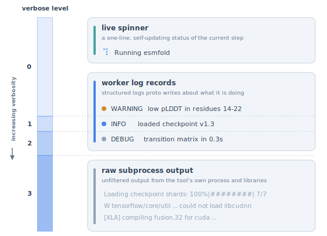

# Worker logging architecture

This note covers how `proto_tools` captures and filters logs from tool subprocesses, including the tagged worker-log stream, the raw subprocess stream, verbosity levels, and the producer API for emitting worker logs.

## Why this exists

Each tool's heavy work runs in an isolated subprocess (a micromamba env with the tool's deps). Subprocess stderr is the only diagnostic channel back to the parent. By default, third-party libraries (HuggingFace, JAX, PyRosetta, etc.) flood that channel with progress bars, compile messages, deprecation warnings, and C/C++ output. Without structure, "verbose mode" is unusable. Without any visibility, silent worker hangs are undebuggable.

This system splits subprocess stderr into two streams and lets standard Python `logging` filter the high-signal one.

## The two streams

Subprocess stderr carries two kinds of output:

- **Tagged worker logs.** Records emitted through `standalone_helpers.get_logger` (under the `worker.*` namespace) are serialized by `_BridgeHandler` into tagged JSON lines.
- **Untagged output.** Everything else reaches the same stderr pipe untagged, including third-party Python loggers, direct `print()`, and C/C++ writes such as PyRosetta `std::cout`, JAX XLA compile output, and tqdm progress bars.

On the parent side, the drain thread demultiplexes by tag:

- **Tagged records** have their `worker.` prefix stripped and are re-emitted on `proto_tools.worker.{toolkit}.{name}`, where the standard handlers fire, including `SpinnerFromLogsHandler` for records flagged `update_status=True`.
- **Untagged bytes** always go to a ring buffer (consulted by `_crash_context()`) and are teed to the parent's `sys.stderr` only when the verbose level is 3 or higher.

## Producer API

Inside any standalone script or helper submodule, use:

```python
from standalone_helpers import get_logger

logger = get_logger(__name__)

logger.info("Loaded checkpoint v1.3")              # info log
logger.info("Sampling chain A", update_status=True)  # spinner takeover
logger.debug("transition matrix in 0.3s")          # debug
logger.warning("low pLDDT in residues 14-22")      # warning
```

`get_logger(name)` returns `logging.getLogger(f"worker.{name}")`. The `worker.*` namespace is what the bridge handler attaches to inside the subprocess. The parent's drain thread strips the `worker.` prefix and re-emits each record under `proto_tools.worker.{toolkit}.{name}`, so the toolkit identity lives only on the parent side.

The `update_status=True` kwarg is provided by `ProtoLogger`, a `logging.Logger` subclass installed via `logging.setLoggerClass`. It translates to `extra={"update_status": True}` so the flag lands as a `LogRecord` attribute. All public log methods (`info`, `debug`, `warning`, `error`, `critical`) accept the kwarg.

The convention is enforced by `tests/style_consistency_tests/test_standalone_logger_consistency.py`. Any module-level `logger = X(__name__)` in a standalone must use `get_logger`, and `logging.getLogger(__name__)` / `getLogger(__name__)` are forbidden (their loggers fall outside the `worker.*` namespace and would never reach the bridge).

## Why the bridge ships in `standalone_helpers/`

Tool subprocesses run in isolated micromamba venvs that don't have `proto_tools` (or `pydantic`, etc.) installed. The bridge implementation lives at `proto_tools/utils/standalone_helpers_source/standalone_helpers/proto_logging.py` and is copied into each tool's `standalone/` directory at worker startup by `_copy_standalone_helpers()`. The bootstrap then triggers `install()` via `import standalone_helpers` (gated on `TOOL_VENV_PATH` in the package `__init__`), so the bridge is in place before the standalone module's body runs.

This avoids any cross-venv `proto_tools` import. The producer side of the architecture is purely stdlib.

## Verbosity levels



`BaseConfig.verbose: int` is a 0/1/2/3 scale. The `PROTO_WORKER_VERBOSE` env var matches the same scale and acts as a global ceiling override (`max(config.verbose, env)`).

| Level | proto_tools logs in console | Spinner | Untagged subprocess stderr |
|---|---|---|---|
| **0** (quiet, default) | WARNING+ | active; subtitle takes over from records flagged with `update_status=True` | hidden (ring buffer only) |
| **1** (info) | INFO+ | active | hidden |
| **2** (debug) | DEBUG+ | active | hidden |
| **3** (raw) | DEBUG+ | active | teed to parent stderr |

`bool` callers are not disrupted. Pydantic v2 coerces `True` → `1` and `False` → `0` when the field type is `int`.

The level → log-level mapping (0→WARNING, 1→INFO, 2→DEBUG, 3→DEBUG) is applied to the `proto_tools.worker.{toolkit}` logger. For persistent workers, the value is latched on `PersistentWorker._verbose` at construction time (via `ToolInstance._run_persistent`) and applied once per drain-thread startup, so mid-run env-var toggles never race the drain. For one-shot tools, `_run_oneshot` reads the effective level (`max(int(verbose), verbose_level_from_env())`) at each call and applies it directly. `raw_tee` (untagged stderr mirror) fires at level 3 only.

## Third-party progress bar handling

A tqdm progress bar (as used by HuggingFace, transformers, and datasets) writes `\r`-separated frames ending in a newline. These arrive on untagged stderr and pass through `_drain_subprocess_stderr` into `_handle_raw_stderr_line`. At levels 0 through 2 the line is not teed. It lands in the ring buffer as the final frame only. At level 3, `line.rsplit("\r", 1)[-1]` keeps only the final frame and then tees it.

The net behavior is that at level 3, you see the start banner and "100% complete" of each progress bar, and intermediate frames are dropped. Newline-separated progress libraries (rich, alive-progress) are not filtered and produce one line per frame at level 3. This is acceptable noise since the user opted in.

## Filtering recipes

```python
import logging

# Default: WARNING+ from any worker
logging.getLogger("proto_tools.worker").setLevel(logging.WARNING)

# Debug bioemu specifically
logging.getLogger("proto_tools.worker.bioemu").setLevel(logging.DEBUG)

# Quiet a chatty submodule even within bioemu
logging.getLogger("proto_tools.worker.bioemu.standalone_helpers.weights").setLevel(logging.ERROR)

# Firehose for everything proto_tools-authored
logging.getLogger("proto_tools.worker").setLevel(logging.DEBUG)
```

Standard Python logging hierarchy applies to records re-emitted by the drain thread. Untagged third-party output cannot be filtered by namespace (it never goes through `logging`). Use the int verbosity scale instead.

## Implementation map

| Component | Location | Role |
|---|---|---|
| `ProtoLogger` (subprocess) | `standalone_helpers/proto_logging.py` | Logger subclass; adds `update_status` kwarg |
| `_BridgeHandler` | `standalone_helpers/proto_logging.py` | Subprocess-side: serializes records as tagged JSON on stderr |
| `install` | `standalone_helpers/proto_logging.py` | Attaches `_BridgeHandler` at the `worker` logger; idempotent |
| `get_logger(name)` | `standalone_helpers/proto_logging.py` | Producer convention: returns `logging.getLogger(f"worker.{name}")` |
| `standalone_helpers/__init__.py` | same dir | Calls `install()` once when `TOOL_VENV_PATH` is set |
| `ProtoLogger` (parent) | `proto_tools/utils/logging_config.py` | Logger subclass for parent-side `update_status` kwarg |
| `SpinnerFromLogsHandler` | `proto_tools/utils/logging_config.py` | Parent-side: routes flagged records to the active bar via `update_active_substatus(...)` |
| `install_logger_class` | `proto_tools/utils/logging_config.py` | Sets `ProtoLogger` as default class; called from `proto_tools/__init__.py` |
| `install_spinner_handler` | `proto_tools/utils/logging_config.py` | Attaches spinner handler to `proto_tools` logger |
| `verbose_level_from_env` | `proto_tools/utils/logging_config.py` | Parses `PROTO_WORKER_VERBOSE` as int 0..3 |
| `_TAG_PREFIX` | `proto_tools/utils/logging_config.py` (parent) and `standalone_helpers/proto_logging.py` (subprocess) | Wire-format constant; **must match** on both sides |
| `_drain_subprocess_stderr` / `_handle_raw_stderr_line` / `_reemit_tagged_line` | `proto_tools/utils/persistent_worker.py` | Drain thread; demuxes tagged lines, ring-buffers / tees untagged |
| `BaseConfig.verbose` | `proto_tools/utils/base_config.py` | User-facing int knob (0/1/2/3) |
| `_run_oneshot` / `_run_persistent` | `proto_tools/utils/tool_instance.py` | Honor `effective = max(verbose, env)` and pass `raw_tee` to the drain |
| `_install_subprocess_logging_bridge` | `proto_tools/utils/_worker_bootstrap.py` | Imports `standalone_helpers` to trigger `install()` before the standalone loads |

## Tunable: stderr ring buffer size

`PersistentWorker` keeps the last N untagged stderr lines per worker as a bounded `collections.deque`, surfaced by `_crash_context()` for error messages. Default is 20. Override globally with `PROTO_WORKER_STDERR_BUFFER_LINES=N` (e.g. `100` when triaging a hard-to-reproduce hang). The deque is bounded so long-running workers don't accumulate stderr indefinitely.

## Subtleties to know about

- The producer side has **zero `proto_tools` imports**. The full bridge implementation ships via `standalone_helpers/proto_logging.py` (stdlib-only). It must be stdlib-only because a `from proto_tools.utils.logging_config import ...` path would fail silently in every tool venv. `proto_tools` (and `pydantic`) are not installed inside the venv.
- `install()` attaches the bridge at the **`worker` logger**, not at root and not at `proto_tools`. Third-party loggers (`transformers`, `urllib3`, etc.) sit on root. They reach untagged stderr through their own handlers (or get dropped) but **never become tagged JSON**. This is the namespace-isolation guarantee.
- `install()` sets `propagate=False` on the `worker` logger so records don't double-emit through any host-configured root handler.
- The parent re-emits each tagged record under `proto_tools.worker.{toolkit}.{name}`. This is also where `SpinnerFromLogsHandler` (attached at `proto_tools`) sees flagged records via standard logging propagation.
- stdout is **never written by the logging system**. It's reserved for the JSON-line request/response protocol between parent and worker.
- `proto_tools/__init__.py` adds `proto_tools/utils/standalone_helpers_source/` to `sys.path` so any parent-side code that imports a standalone module (e.g. `proteinmpnn/__init__.py` re-exporting `ALPHAFOLD_VOCAB`) can resolve `from standalone_helpers import X`. Inside a tool subprocess, the bootstrap inserts the per-tool `standalone/` dir ahead of this entry, so the freshly-copied local version always wins.
