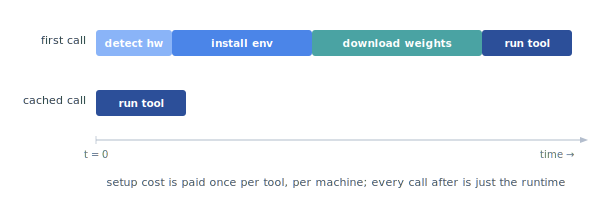

# Tool Environments Reference

This note covers standalone tool environment setup, compute dependency management, and environment isolation. For model weight storage and `PROTO_HOME` configuration, see [storage.md](storage.md).




## Compute Dependency Management

Tools with PyTorch/JAX dependencies use **centralized hardware detection** (`utils/compute_deps.py`) to automatically select compatible package versions based on the host's NVIDIA driver and CUDA versions.

**How it works:**

1. `persistent_worker.py` calls `detect_compute_environment()` when building the subprocess environment
2. Detection inspects `nvidia-smi` output to extract driver and CUDA versions
3. Compatibility matrices map driver major versions to package version constraints
4. Environment variables are injected into the subprocess before `setup.sh` runs
5. Tool setup scripts consume these variables to install the right package versions

**Environment variables injected:**

| Variable | Example Value | Description |
|---|---|---|
| `DETECTED_COMPUTE_PLATFORM` | `"cuda"` or `"cpu"` | Hardware platform detected |
| `DETECTED_DRIVER_VERSION` | `"570"` | NVIDIA driver major version |
| `DETECTED_CUDA_VERSION` | `"12"` | CUDA toolkit major version |
| `RECOMMENDED_TORCH_SPEC` | `"torch>=2.10,<3"` | PyTorch version constraint for detected driver |
| `RECOMMENDED_JAX_SPEC` | `"jax[cuda12]>=0.5,<1"` | JAX version constraint with CUDA plugin |
| `RECOMMENDED_JAX_VARIANT` | `"cuda12"` | JAX CUDA variant (cuda12, cuda13) |

### Standard PyTorch Setup Pattern

See `esm2`, `esmfold`, `boltz2` for reference implementations:

```bash
#!/bin/bash
set -euo pipefail

echo "Installing uv package manager..."
pip install uv

# Install hardware-aware PyTorch version (from centralized detection)
echo "Installing PyTorch: ${RECOMMENDED_TORCH_SPEC:-torch} (platform: ${DETECTED_COMPUTE_PLATFORM:-unknown})"
uv pip install "${RECOMMENDED_TORCH_SPEC:-torch}" --extra-index-url "${RECOMMENDED_TORCH_INDEX}"

echo "Installing remaining dependencies..."
uv pip install -r requirements.txt
```

### Standard JAX Setup Pattern

See `alphagenome` for reference:

```bash
JAX_VARIANT="${TOOL_JAX_VARIANT:-${RECOMMENDED_JAX_VARIANT:-cuda12}}"
JAX_SPEC="${TOOL_JAX_SPEC:-${RECOMMENDED_JAX_SPEC:-jax[cuda12]>=0.5,<1}}"

echo "Detected platform: ${DETECTED_COMPUTE_PLATFORM:-unknown}"
echo "Installing JAX: ${JAX_SPEC}"
uv pip install "${JAX_SPEC}"
```

### TensorFlow Setup Pattern

Because there is no centralized TensorFlow recommendation (only PyTorch and JAX), TF tools install it directly in setup.sh, branching on `DETECTED_COMPUTE_PLATFORM`. See `spliceai` for reference:

```bash
if [ "${DETECTED_COMPUTE_PLATFORM:-cpu}" = "cuda" ]; then
    uv pip install "tensorflow[and-cuda]~=2.15.0"
else
    uv pip install "tensorflow~=2.15.0"
fi
```

Pin `tensorflow~=2.15.0` to keep Keras 2, because Keras 3 in TF &ge;2.16 cannot load older `.h5` models. This forces `python_version.txt` to `3.11`, since TF 2.15 has no py3.12 wheels.

### Tool-Specific Overrides

Tools can override centralized recommendations via env_vars.txt or tool-specific environment variables (e.g., `SPLICE_TRANSFORMER_TORCH_SPEC`, `ALPHAGENOME_JAX_SPEC`, `SPLICEAI_TF_SPEC`).

### Pinned-Version Tools

Some tools have hard version pins for ABI compatibility with pre-built wheels (flash-attn, transformer-engine). These tools explicitly pin torch versions in their setup.sh and should NOT be migrated to use dynamic version selection:
- `evo1`: `torch==2.7.1` (flash-attn ABI compatibility)
- `evo2`: `torch==2.6.0` (flash-attn + transformer-engine compatibility)
- `borzoi`: `torch==2.7.1` (flash-attn wheel compatibility)

### Compatibility Matrices

Based on official sources (PyTorch RELEASE.md, JAX docs, NVIDIA CUDA compatibility):

**PyTorch** (driver → torch version):
- Driver 570+: torch 2.8+ (CUDA 12.8 native support)
- Driver 550-569: torch 2.5+ (CUDA 12.4 native support)
- Driver 535-549: torch 2.4-2.6.x (CUDA 12.2, and 2.7+ ships CUDA 12.8 runtime libs)
- Driver 525-534: torch 2.4-2.6.x (CUDA 12.0-12.1)
- Driver &lt;525: torch 2.1-2.3 (CUDA 11.x era)

**JAX** (driver + CUDA → jax version + variant):
- Driver 525+: jax[cuda12] 0.4.20+ (all CUDA 12.x)
- Driver 580+: jax[cuda13] 0.4.20+ (CUDA 13.x)
- Driver &lt;525: jax[cuda11] 0.4.20+ (CUDA 11.x)

See `tests/tool_infra_tests/test_compute_deps.py` for comprehensive test coverage.

## Debugging Env Setup (`PROTO_ENV_VERBOSE`, `PROTO_ENV_LOG_DIR`)

When `ToolInstance._create_env()` runs `standalone/setup.sh` to build a tool's venv, the subprocess output is normally captured quietly and only surfaced on failure (via `STATUS.txt` and the raised `RuntimeError`). Two env vars opt into richer visibility:

- `PROTO_ENV_VERBOSE=1` streams each line of `setup.sh`'s output live to the caller's stderr as the subprocess runs. Useful for watching long installs (PyTorch, flash-attn, transformer-engine, etc.) in real time and for diagnosing hangs.
- `PROTO_ENV_LOG_DIR=<path>` copies the complete log to `<PROTO_ENV_LOG_DIR>/<toolkit>_setup.log` after `setup.sh` exits (success or failure). Useful when the env directory itself is ephemeral and you want the log to survive a rollback.

Regardless of either flag, the combined output is always written to `<env_path>/setup.log` during setup, so you can inspect it after the fact from any env that still has its files on disk.

Both variables default to off, so setup output stays quiet unless a caller opts in. See `tests/tool_infra_tests/test_tool_instance.py::test_run_setup_script_*` for the behavior contract.

## Overriding a tool's standalone env (`PROTO_<TOOLKIT>_STANDALONE_DIR`)

When a tool's packaged `standalone/` setup does not work on your machine (a cluster needs a different CUDA wheel, a pinned version has to change, an install step needs patching) you can override the whole env definition without editing the installed package. This works identically whether proto-tools was installed editable (`pip install -e`) or as a regular wheel, since the override points at a directory you control rather than at the package. Two pieces:

- `proto-tools eject-standalone <toolkit> [--dir DIR]` copies the tool's packaged env-def directory (resolving shared envs) into `DIR/<toolkit>/` (default `./proto_standalone/<toolkit>/`), giving you an editable copy of every file the env is built from (`setup.sh`, `python_version.txt`, `requirements.txt`, `env_vars.txt`, ...). It always copies the packaged baseline, ignoring any active override.
- `PROTO_<TOOLKIT>_STANDALONE_DIR=<path>` makes `ToolInstance._resolve_env_def` use `<path>` as the env-def dir instead of the packaged one. `<TOOLKIT>` is the toolkit's **folder name** uppercased (e.g. `esm2` → `PROTO_ESM2_STANDALONE_DIR`), not a tool registration key like `esm2-embed`. `eject-standalone` accepts either form and prints the exact variable to export. The override builds under an isolated env name (`<toolkit>__override_<hash>_env`), so it never clobbers the packaged env and two projects pointing at different override dirs get separate envs on disk. Editing the override's files triggers the usual setup-hash rebuild.

Typical flow:

```bash
proto-tools eject-standalone esm2                   # -> ./proto_standalone/esm2/
# edit ./proto_standalone/esm2/setup.sh
export PROTO_ESM2_STANDALONE_DIR=$PWD/proto_standalone/esm2
# the next call to an esm2 tool builds from your version of the standalone folder that lives at the location you specified above
```

proto-tools reads the variable from the process environment (`os.environ`). It does not parse `.env` or `.envrc` files itself. To scope the override to one project instead of setting it globally in `.bashrc`, export it in that project's shell, or use `direnv` (its `.envrc` is loaded into your shell on `cd`, so the variable reaches proto-tools through the environment). A bare `.env` file only takes effect if you load it yourself (`direnv`'s `dotenv` directive, `python-dotenv`, `export $(...)`, etc.). If `PROTO_<TOOLKIT>_STANDALONE_DIR` is set but the path is not a directory or is missing `setup.sh`/`python_version.txt`, env resolution fails immediately with a message that names the variable, the path, and how to produce a valid directory.

This works whether proto-tools is run from a clone or pip-installed, editable or non-editable.

## Conda Environment Registration

Proto-tools writes `register_envs: false` to `PROTO_HOME/.micromamba/condarc` so micromamba-managed tool environments do not appear in the user's global `conda env list`. During micromamba setup, `ToolInstance` also removes existing registry entries under the current `PROTO_HOME/proto_tool_envs/` and `PROTO_HOME/.foundation_env/` roots from `~/.conda/environments.txt`. Unrelated conda environments are left untouched.

## env_vars.txt

Each tool's `standalone/env_vars.txt` supports three sections:
- `[passthrough]`: Variable names copied from the parent environment (e.g., `HF_TOKEN`)
- `[set]`: Literal `KEY=VALUE` assignments, with `${VENV_PATH}` interpolation
- `[no_passthrough]`: Variable names whose parent value is **blocked** from leaking into the subprocess. For `LD_LIBRARY_PATH` this also skips the `$CONDA_PREFIX/lib` append, though the host directory containing `libcuda.so.1` is still added so GPU init works, and `[set]` entries still apply. Use this for tools whose pip-bundled libs (e.g. JAX's RPATH'd CUDA wheels) get ABI-shadowed by the parent's libs.

**Auto-set environment variables** (always injected by `_build_subprocess_env()`):
- `CONDA_PREFIX`: set to the **tool env path** (not the parent conda env) so uv/pip install into the correct environment
- `VIRTUAL_ENV`: set to the **tool env path** for uv >=0.10 compatibility
- `PATH`: `tool_env/bin` > `cuda/bin` (GPU) > parent PATH entries > system dirs
- `LD_LIBRARY_PATH`: tool-specific `[set]` paths > parent `LD_LIBRARY_PATH` entries > `$CONDA_PREFIX/lib` (the latter two are skipped when `LD_LIBRARY_PATH` is in `[no_passthrough]`, in which case just the host's `libcuda.so.1` dir is appended)

## Foundation Environment (git, curl, make, cmake, pkg-config, gcc, g++)

`setup.sh` scripts assume `git`, `curl`, `make`, `cmake`, `pkg-config`, `gcc`, and `g++` are on `PATH` (tools like `bindcraft`/`pyrosetta` compile DAlphaBall via `make`, and AlphaFold3 builds a C++ extension). When the host already provides all of them with `gcc`/`g++` major version `>= MIN_FOUNDATION_GCC`, `ToolInstance._ensure_foundation_env` is a no-op. Otherwise it provisions a shared micromamba env at `PROTO_HOME/.foundation_env/` (`git curl make cmake pkg-config`, pinning `gcc>=MIN_FOUNDATION_GCC` / `gxx>=MIN_FOUNDATION_GCC`) and prepends its `bin/` to the setup script's `PATH`. Set `PROTO_USE_FOUNDATION_ENV=1` to force-install or `=0` to force-skip the probe.

## GCC/nvcc Compatibility for CUDA JIT Tools

Tools that JIT-compile CUDA C++ extensions install a compatible GCC from conda-forge. The GCC version is chosen per-tool based on the CUDA toolkit version.

**CUDA → max GCC mapping:**
- CUDA 12.1: GCC ≤12
- CUDA 12.4: GCC ≤13.2
- CUDA 12.6: GCC ≤14
- CUDA 12.8: GCC ≤14

**Per-tool versions:**
- **evo1** (CUDA 12.1): `"gcc=12.*" "gxx=12.*" "sysroot_linux-64=2.17"`
- **protenix** (CUDA 12.1): `"gcc=12.*" "gxx=12.*" "sysroot_linux-64=2.17"`
- **evo2** (latest CUDA ~12.8): `"gcc=14.*" "gxx=14.*"`

**Why sysroot 2.17 for GCC 12 tools:** conda-forge GCC packages pull in the latest sysroot by default, but sysroot 2.34+ adds `_Float32`/`_Float16` typedefs in `<stdlib.h>` that nvcc 12.1's EDG parser rejects, so pinning to glibc 2.17 avoids this.

**Pattern:**
1. Add `gcc`/`gxx` (+ `sysroot_linux-64` if needed) to the micromamba create command
2. For runtime JIT tools (protenix), also set `CC`/`CXX` in `sitecustomize.py`

## Cache Management for ABI-Sensitive Packages

Tools that install C++ extensions with ABI dependencies (torch, flash-attn, transformer-engine) must clear package manager caches to prevent compatibility issues. Cached wheels may be built against different PyTorch/CUDA/compiler versions, causing runtime failures with symbols like `undefined symbol: _ZN3c105ErrorC2ENS_14SourceLocationESs`.

**Standard pattern for ABI-sensitive tools** (evo1, evo2, borzoi):

```bash
echo "Installing uv package manager..."
pip install uv

# Clear caches BEFORE installing any ABI-sensitive packages
echo "Clearing package caches for ABI-sensitive dependencies..."
uv cache clean torch 2>/dev/null || true
uv cache clean flash-attn 2>/dev/null || true
uv cache clean transformer-engine 2>/dev/null || true  # if used

# Install with --refresh flag as defense-in-depth
echo "Installing torch..."
uv pip install torch==X.Y.Z --extra-index-url "${RECOMMENDED_TORCH_INDEX}" --refresh

echo "Installing flash-attn..."
uv pip install --no-build-isolation flash-attn==A.B.C --refresh

# Validate the deepest import used by runtime code
if ! python -c "import flash_attn_2_cuda" 2>/dev/null; then
    echo "flash-attn wheel has ABI mismatch, rebuilding from source..."
    uv pip install --no-build-isolation --no-binary flash-attn --reinstall-package flash-attn flash-attn==A.B.C
fi
```

**Key requirements:**
1. Clear caches early (`uv cache clean <package>`)
2. Use `--refresh` on all ABI-sensitive installs
3. Validate deep imports (e.g., `flash_attn_2_cuda`), not just Python wrappers
4. Use `2>/dev/null || true` for graceful failure

**For direct URL installs** (e.g., GitHub release wheels), use pip's `--force-reinstall`.

**Reference implementations:**
- `proto_tools/tools/causal_models/evo1/standalone/setup.sh`
- `proto_tools/tools/causal_models/evo2/standalone/setup.sh`
- `proto_tools/tools/sequence_scoring/borzoi/standalone/setup.sh`

## Python Version Specification

Every tool with a `standalone/` directory must ship a `standalone/python_version.txt` that pins its Python version. The consistency tests fail if any tool is missing the file, and `ToolInstance._get_python_version` raises `FileNotFoundError` on setup for a tool whose file is missing.

**Format:** keyed lines, with a required `default` and optional per-platform overrides. Comments (`#` to end of line) and blank lines are ignored. Whitespace around `:` is stripped, and keys are lowercased.

```text
# Comments and blank lines are allowed.
default: 3.11
linux: 3.10            # OS-only fallback (any Linux)
linux-aarch64: 3.10    # specific arch override (most specific)
darwin-arm64: 3.10
```

**Lookup (most specific wins):**

1. Exact `{system}-{machine}` key, e.g. `linux-aarch64`
2. OS-only `{system}` key, e.g. `linux`
3. `default` (required catch-all)

The lookup key is built as `f"{platform.system().lower()}-{platform.machine()}"`:

| Platform | Specific key | OS key |
|---|---|---|
| Linux x86_64 | `linux-x86_64` | `linux` |
| Linux ARM | `linux-aarch64` | `linux` |
| macOS Intel | `darwin-x86_64` | `darwin` |
| macOS Apple Silicon | `darwin-arm64` | `darwin` |

**Validation:** every value must be `major.minor[.patch]` with `major == 3` and `minor >= 8`. All values are validated up front, so a typo in any override fails on any developer's machine, not just the affected platform.

**When to use overrides:** declare a per-platform override only when a tool's upstream dependency is unavailable for the default Python on that platform (e.g., PyRosetta on `linux-aarch64` only ships py39/py310 builds, so it pins `linux-aarch64: 3.10`). Use the OS-only tier when an entire OS family needs a different version. The reference example is `proto_tools/tools/structure_scoring/pyrosetta/standalone/python_version.txt`.

**Rebuilds:** the file content **and the resolved version** are both included in the environment setup hash, so any edit triggers a rebuild and two platforms with different resolved versions get distinct hashes (matters when `PROTO_HOME` is on shared storage).

**Consistency tests:** every shipped `python_version.txt` is validated by `tests/style_consistency_tests/test_python_version_consistency.py` (one parametrized result per tool). Parser unit tests live in `tests/tool_infra_tests/test_python_version_files.py`.

## Shared Environments

Multiple tools may rely on the same dependencies. For example, ESM3 and ESM C, which both come from `Biohub/esm`, can share a single micromamba environment on disk, which avoids duplicating environments when adding a sibling model.

**Layout:**

```
proto_tools/
├── shared_envs/
│   └── biohub_esm/                 # one env definition
│       ├── setup.sh
│       ├── requirements.txt
│       └── python_version.txt
└── tools/
    └── masked_models/
        ├── esm3/
        │   └── standalone/
        │       ├── shared_env.txt   # contents: "biohub_esm"
        │       └── inference.py     # ESM3-specific dispatch
        └── esmc/
            └── standalone/
                ├── shared_env.txt   # contents: "biohub_esm"
                └── inference.py     # ESM C-specific dispatch
```

**How it resolves:** When a tool's `standalone/` contains a `shared_env.txt` marker, `ToolInstance._resolve_env_def()` reads the marker, looks up `proto_tools/shared_envs/<name>/`, and uses that directory's `setup.sh` / `requirements.txt` / `python_version.txt` / `env_vars.txt` for env construction. The on-disk env path becomes `PROTO_HOME/proto_tool_envs/<name>_env/` so all tools opting into the same shared env collide on the same physical directory and skip redundant setup.

**`inference.py` always lives per-tool.** Only env-construction inputs are shared, and each tool ships its own dispatch logic.

**Validation:**

- A tool with both `shared_env.txt` and `setup.sh` raises (ambiguous).
- A `shared_env.txt` pointing to a non-existent shared env raises with a clear error at dispatch time.
- An empty `shared_env.txt` raises.

**Concurrency:** Existing setup-lock at `<env_path>/.setup.lock` serializes concurrent setup attempts from different tools.

**When to use a shared env:**

- Two or more tools install the same heavy Python package and the same Python version.
- A new tool ships in an upstream package that already has a wrapper using the shared-env pattern.

**When NOT to use:** Tools with conflicting Python versions, conflicting framework version pins, or genuinely independent dependency sets.

**Migration note:** When a tool adopts a shared env (e.g. `esm3` migrated to `biohub_esm`), its on-disk env directory changes from `<toolkit>_env/` to `<shared_name>_env/`. The old directory is orphaned but harmless, and users can manually delete `PROTO_HOME/proto_tool_envs/<old_name>_env/` to reclaim disk.

## Binary Installation

Tools needing external binaries must use `utils/install_binary.py`. Never use raw `curl`/`wget` in `setup.sh`.

1. Create `standalone/binary_config.py` with:
   - `URLS`: dict mapping `(system, machine)` tuples to download URLs (use `"arm64"` not `"aarch64"`)
   - `extract(archive_path: Path, bin_dir: Path)`: extracts/copies binaries into bin/
2. In `setup.sh`, call `python "$SEARCH_DIR/utils/install_binary.py" <toolkit>`

See blast or mmseqs for the standard pattern, and for platform-independent tools (e.g., Java JARs), use the same URL for all platform keys.

The downloader streams chunks with a per-read socket timeout, validates the final size against `Content-Length` so silent truncation surfaces as a retryable error, and retries with exponential backoff (see `_MAX_DOWNLOAD_RETRIES`, `_INITIAL_RETRY_DELAY_SECONDS`, `_BACKOFF_MULTIPLIER`, `_MAX_RETRY_DELAY_SECONDS`, `_SOCKET_TIMEOUT_SECONDS` in `install_binary.py`).

## Compile-from-Source Tools

Tools distributed as C/C++ source compile during `setup.sh`, so no `binary_config.py` or `requirements.txt` is needed. The script just checks for the compiler (`g++`), clones the source, compiles into the venv's `bin/`, and cleans up. Use `BUILD_DIR` (not `TMPDIR`) for the temporary clone directory. See TMalign/USalign (`tools/structure_alignment/`) as canonical examples.

## Standalone Helpers for CLI Subprocess Device Routing

For tools that spawn CLI subprocesses (Boltz2, RFDiffusion3, Protenix, AlphaFold3), `get_subprocess_device_env()` ensures correct device routing when the parent process has `CUDA_VISIBLE_DEVICES` set.

**The problem:** When DeviceManager allocates a logical device (e.g., `cuda:2`), CLI subprocesses need the physical GPU index mapped from the logical index.

**The solution:** the `standalone_helpers/` package (`utils/standalone_helpers_source/standalone_helpers/device.py`) provides `get_subprocess_device_env(device: str) -> dict[str, str]`:

```python
from standalone_helpers import get_subprocess_device_env

env = get_subprocess_device_env("cuda:2")  # Maps to physical GPU
subprocess.run(cmd, env=env)
```

**Auto-copy mechanism:**
- Source: `proto_tools/utils/standalone_helpers_source/standalone_helpers/` (the package, tracked in git, alongside `standalone_helpers.sh`)
- Destination: `{tool}/standalone/standalone_helpers/` (not tracked, auto-copied at runtime by `_worker_bootstrap.py`)

**Consistency enforcement:** The parametrized test `tests/tool_infra_tests/test_device_manager/test_tool_device_consistency.py::test_standalone_protocol_compliance` verifies that any tool making subprocess calls imports `get_subprocess_device_env()` and passes its result as `env=`.

## Device movement: `to_device()` (PyTorch) vs. `pin_visible_devices` (JAX)

**PyTorch tools** (ESMFold, Evo2, ESM2, etc.) implement a `to_device(device: str) -> dict` function in their standalone script. DeviceManager calls it via the worker bootstrap when `ToolInstance.to(device)` is invoked, moving the loaded model between devices **in-process** (CPU offload, GPU↔GPU):
```python
def to_device(device: str) -> dict:
    global _model
    if _model is not None and _model._loaded:
        _model.to_device(device)
        return {"success": True, "device": device}
    return {"success": True, "device": device, "note": "model not loaded yet"}
```
The wrapper's `.to_device()` uses `move_model_to_device()` from `standalone_helpers`, which calls `model.to()` and frees CUDA memory via `torch.cuda.empty_cache()` when moving off GPU.

**JAX tools** (AlphaFold2, ProteinMPNN, AlphaGenome, …) do **not** implement `to_device()`. A JAX runtime initializes a context on *every* visible GPU, so these tools set `pin_visible_devices=True` on the `@tool` registration. The worker is then spawned with `CUDA_VISIBLE_DEVICES` restricted to its assigned physical GPU(s), which it addresses as local `cuda:0..N-1`, and the model is placed on its sole visible GPU at load — there is nothing to move. Because `CUDA_VISIBLE_DEVICES` is fixed for a process, a JAX worker cannot reach another GPU in-process, so DeviceManager **respawns** it on a device change (and kills it on eviction). The user-facing `device=` selection is unchanged; the logical→physical mapping is internal. See `notes/device-management.md`.

`AlphaGenome` additionally sets `gpu_only=True`: its black-box model cannot be CPU-offloaded usefully (CPU compilation takes 10+ minutes), so eviction kills the worker and the next dispatch reloads on GPU.

**Neither pattern works, use `gpu_only=True`**

Some tools can't even do the reload-based pattern safely. The first run works, but the second run crashes the worker, either in the same process or in a fresh subprocess, usually because of an upstream bug in how the library tracks CUDA or XLA state across runs. Mark these with `gpu_only=True` in the `@tool()` decorator:

```python
@tool(
    key="alphagenome-predict-variants",
    ...
    uses_gpu=True,
    gpu_only=True,
    ...
)
```

The framework then changes two things for this tool:

1. **It refuses CPU dispatch up front.** Calling the tool with `config.device="cpu"` raises `ValueError` immediately, so misconfigurations fail clearly instead of crashing deep inside the worker.
2. **On LRU eviction, it kills the worker outright.** Instead of sending `to_device("cpu")` (which would hit the broken reload path), the framework calls `worker.stop()`, logs a warning, and drops the reference. The next time this tool is dispatched, a brand-new subprocess is spawned on GPU from scratch, with fresh imports, fresh model load, and fresh compile. It's slow but always correct.

`gpu_only=True` implies `uses_gpu=True`, which the framework checks at registration. Currently only `alphagenome-predict-variants` opts in, because the other alphagenome variants don't exhibit the consecutive-dispatch crash and so use plain reload-based.

**CLI tools** (Boltz2, RFDiffusion3, BLAST, etc.):
```python
def to_device(device: str) -> dict:
    return {"success": True, "device": device, "note": "CLI tool, auto-unloads"}
```

When implementing new tools, add `to_device()` to `standalone/inference.py` or `standalone/run.py` following the pattern above. The model wrapper class should have a `to_device(device: str)` method for actual device moves.
